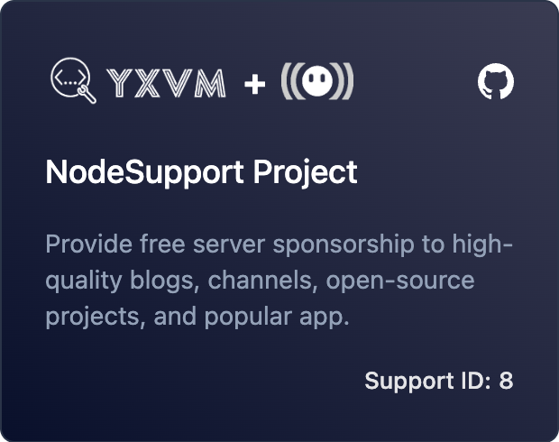

<div align="center">
<br>

<br>
<br>
<h2 align="center">Sub-Store<h2>
</div>

<p align="center" color="#6a737d">
Advanced Subscription Manager for QX, Loon, Surge, Stash, Egern and Shadowrocket.
</p>

[](https://github.com/sub-store-org/Sub-Store/actions/workflows/main.yml)     
<a href="https://trendshift.io/repositories/4572" target="_blank"></a>
[](https://www.buymeacoffee.com/PengYM)

[📚 文档/DOC](https://github.com/sub-store-org/Sub-Store/wiki)

## sub.store Domain Safety Notice

### Statement

⚠️ `sub.store` is only the domain used by module-script rewrite MitM rules. It is not a public domain owned by us.

### Risk

If a request does not go through the rewrite, the data will be sent to the public `sub.store` service.

You can map `sub.store` to `127.0.0.1` or another local address to prevent accidental access to the public `sub.store`. However, ordinary users may still send requests to the public `sub.store` after switching or toggling configuration modules.

1. It could, in theory, redirect users to a fake frontend. This is only a possibility and does not imply that the owner of `sub.store` would do this. Note: The official frontend is `https://sub-store.vercel.app`.
2. It could receive user data from `sub.store`.

This creates a data leakage risk.

### Plan

After listening to suggestions from the group, we will not switch to a new domain for now. Choosing a new domain is also awkward: it needs to be related, short, and unlikely to be registered by someone else, at least in the short term.

This notice is published only as an announcement. No changes will be made for now.

Example:

```
[Host]
sub.store = 127.0.0.1
```

### CORS Allowlist

Sub-Store also supports a configurable browser CORS allowlist for the backend API. This does not change the module rewrite domain, but it limits which browser origins can read API responses through CORS.

- Node/server deployments use `SUB_STORE_CORS_ALLOWED_ORIGINS`; the default is `*` for compatibility.
- Proxy App modules use the `cors` module argument; the default is `https://sub-store.vercel.app,http://substore.stash,https://substore.stash`.
- Multiple origins can be separated by commas. Origins are matched exactly by scheme, host, and port. Set the value to `*` only when you accept the risk of any website reading the local backend through browser CORS.

## Core functionalities:

1. Conversion among various formats.
2. Subscription formatting.
3. Collect multiple subscriptions in one URL.
4. Host and modify subscriptions/files

> The following descriptions of features may not be updated in real-time. Please refer to the actual available features for accurate information.

## 1. Subscription Conversion

### Supported Input Formats

[本地节点怎么写/How To Write A Local Node](https://t.me/zhetengsha/824)

> ⚠️ Do not use `Shadowrocket` or `NekoBox` to export URI and then import it as input. The URIs exported in this way may not be standard URIs. However, we have already supported some very common non-standard URIs (such as VMess, VLESS).

- [x] Proxy URI Scheme(`socks5`, `socks5+tls`, `http`, `https`(it's ok))

  example: `socks5+tls://user:pass@ip:port#name`

- [x] URI(AnyTLS, SOCKS, SS, SSR, VMess, VLESS, Trojan, Hysteria, Hysteria 2, TUIC v5, WireGuard)
  > Please note, HTTP(s) does not have a standard URI format, so it is not supported. Please use other formats.
- [x] Clash Proxies YAML
- [x] Clash Proxy JSON/JSON5/YAML(single line)
  > [NaiveProxy](https://t.me/zhetengsha/4308)
- [x] QX (SS, SSR, VMess, Trojan, HTTP, SOCKS5, VLESS, AnyTLS)
- [x] Loon (SS, SSR, VMess, Trojan, HTTP, SOCKS5, SOCKS5-TLS, WireGuard, VLESS, Hysteria 2, AnyTLS)
- [x] Surge (Direct, SS, VMess, Trojan, HTTP, HTTPS, HTTP/2 CONNECT, SOCKS5, SOCKS5-TLS, AnyTLS, TrustTunnel, TUIC, Snell, Hysteria 2, SSH(Password authentication only), External Proxy Program(only for macOS), WireGuard(Surge to Surge))
- [x] mihomo(Clash.Meta) Compatible (Direct, SS, SSR, VMess, Trojan, HTTP, SOCKS5, Snell, VLESS, WireGuard, Hysteria, Hysteria 2, TUIC, SSH, mieru, sudoku, AnyTLS, MASQUE, Tailscale, GOST Relay, Shadow QUIC)

Deprecated(The frontend doesn't show it, but the backend still supports it, with the query parameter `target=Clash`):

- [x] Clash (SS, SSR, VMess, Trojan, HTTP, SOCKS5, Snell, VLESS, WireGuard)

### Supported Target Platforms

- [x] Plain JSON
- [x] Stash
- [x] Clash.Meta(mihomo)
- [x] Surfboard
- [x] Surge
- [x] SurgeMac(Use mihomo to support protocols that are not supported by Surge itself)
- [x] Loon
- [x] Egern
- [x] Shadowrocket
- [x] QX
- [x] sing-box
- [x] V2Ray
- [x] V2Ray URI

Deprecated:

- [x] Clash

## 2. Subscription Formatting

### Filtering

- [x] **Regex filter**
- [x] **Discard regex filter**
- [x] **Region filter**
- [x] **Type filter**
- [x] **Useless proxies filter**
- [x] **Script filter**

### Proxy Operations

- [x] **Set property operator**: set some proxy properties such as `udp`,`tfo`, `skip-cert-verify` etc.
- [x] **Flag operator**: add flags or remove flags for proxies.
- [x] **Sort operator**: sort proxies by name.
- [x] **Regex sort operator**: sort proxies by keywords (fallback to normal sort).
- [x] **Regex rename operator**: replace by regex in proxy names.
- [x] **Regex delete operator**: delete by regex in proxy names.
- [x] **Script operator**: modify proxy by script.
- [x] **Resolve Domain Operator**: resolve the domain of nodes to an IP address.

### Development

Install `pnpm`

Go to `backend` directories, install node dependencies:

```
pnpm i
```

```
SUB_STORE_BACKEND_API_PORT=3000 pnpm esbuild:dev
```

or this one if you're using `Termux`

```
SUB_STORE_BACKEND_API_PORT=3000 pnpm run --parallel "/^dev:.*/"
```

### Build

```
pnpm bundle:esbuild
```

## LICENSE

This project is under the GPL V3 LICENSE.

[](https://app.fossa.com/projects/git%2Bgithub.com%2FPeng-YM%2FSub-Store?ref=badge_large)

## Star History

[](https://star-history.com/#sub-store-org/sub-store&Date)

## Acknowledgements

- Special thanks to @KOP-XIAO for his awesome resource-parser. Please give a [star](https://github.com/KOP-XIAO/QuantumultX) for his great work!
- Special thanks to @Orz-3 and @58xinian for their awesome icons.

## Sponsors

[](https://yxvm.com)

[NodeSupport](https://github.com/NodeSeekDev/NodeSupport) sponsored this project.

## 致谢

感谢赞助商 [ForZTN](https://sponsorship.forztn.com/github/sub-store-org/Sub-Store) 对项目服务器的支持，感谢。
