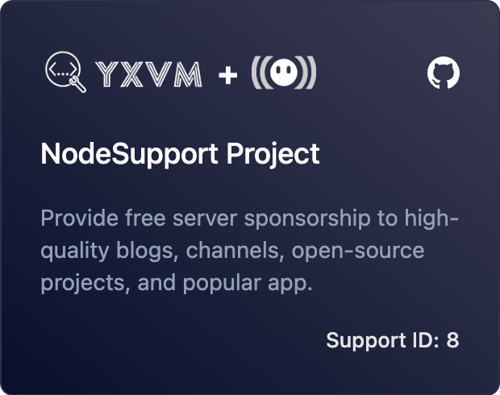

<p align="center">

</p>
<h1 align="center">Sub-Store</h1>

> Advanced Subscription Manager for QX, Loon, Surge, Stash, Egern and Shadowrocket

## Cloudflare Workers backend

This target uses one Durable Object to serialize access and to persist data in
its own built-in SQLite storage, so no external database is required.

### Current feature status

Supported:

- The core Sub-Store backend APIs for managing subscriptions, collections,
  artifacts, files, modules, tokens, settings, and backup data.
- Remote subscription download, parsing, processing, preview, sharing, and
  format production through the Worker's `fetch` implementation.
- Persistent storage in the SQLite-backed Durable Object. Data survives
  Durable Object eviction, Worker restarts, and ordinary code deployments.
- A single, fixed Durable Object named `default`, with request-level
  serialization to protect the original in-memory Sub-Store data model.
- Management API protection through the secret
  `SUB_STORE_FRONTEND_BACKEND_PATH`, plus configurable CORS origins. Public
  download, share, preview, and subscription-flow routes remain available
  without the management path.
- Static Peggy parsers bundled at build time; parser generation is not
  performed dynamically in the Worker.
- Dynamic operator, filter, and response-transformer scripts through the
  embedded QuickJS runtime, subject to the compatibility limits below.
- Deployment through Wrangler or the included GitHub Actions workflow.

Not implemented or intentionally unsupported:

- Frontend asset hosting. Use the official frontend or host a frontend
  separately.
- Scheduled and cron tasks, including artifact cron, sync cron, download cron,
  upload cron, produce cron, and MMDB cron. Cron fields may be stored but are
  not executed by this Worker target.
- Node.js-only facilities such as local filesystem access, child processes,
  local MMDB files, Node proxy agents, and Node environment-based frontend
  hosting.
- Native dynamic JavaScript evaluation by the Workers runtime. Dynamic scripts
  run only inside the restricted QuickJS sandbox described below.
- Push notifications. Notifications are written to Worker logs only.
- Values larger than 1,900,000 bytes in a single storage entry. Large files or
  unusually large top-level datasets may exceed this limit.

### QuickJS compatibility

The QuickJS integration is intended for common Sub-Store operators, filters,
and response transformers. It is not a complete Node.js, Surge, or Loon
runtime.

Available inside QuickJS:

- Standard ECMAScript supported by QuickJS and Promise jobs that can settle
  without timers or external I/O.
- `$arguments`, `$options`, `console`, `$substore` storage/logging methods,
  `$persistentStore`, and `$notification.post`. Notifications log messages
  instead of sending a push notification.
- Synchronous lodash calls, selected synchronous `ProxyUtils` helpers, YAML,
  JSON5, Base64, MD5, flow helpers, and the script resource cache.
- `atob`, `btoa`, and a small `Buffer.from(...).toString(...)` compatibility
  shim for UTF-8 and Base64.
- A 32 MiB QuickJS memory limit, 512 KiB stack limit, and one-second execution
  deadline per invocation.

Unavailable inside QuickJS and reported with an explicit
`[QuickJS runtime]` error:

- `fetch`, timers, `queueMicrotask`, WebSocket, and XMLHttpRequest.
- `$httpClient` and `$substore.http`; the Worker backend itself can perform
  remote HTTP requests, but sandboxed dynamic scripts cannot.
- `require`, `process`, `global`, `module`, and `exports`.
- DNS resolver providers, `produceArtifact`, and network/file-dependent
  `ProxyUtils` functions such as `process`, `processResponse`, `download`,
  `downloadFile`, `doh`, `Gist`, `MMDB`, and `ipAddress`.
- Asynchronous host functions and host API calls that receive JavaScript
  callback functions. Use native array methods inside the script when a
  callback is needed.
- Buffer encodings other than UTF-8 and Base64.

### Build and deploy

To build and deploy:

```sh
cd backend
pnpm bundle:cloudflare
cd ..
pnpm dlx wrangler@latest deploy
```

The included `deploy-cloudflare.yml` workflow deploys pushes to `master` and
also supports manual runs. Add `CLOUDFLARE_API_TOKEN` and
`CLOUDFLARE_ACCOUNT_ID` to the repository's GitHub Actions secrets. The
workflow does not receive or manage the runtime authentication secret.

After deployment, set `SUB_STORE_FRONTEND_BACKEND_PATH` as an encrypted Secret
in the Worker's Cloudflare dashboard settings before using the management API.
This path is the management credential: use a long, random, unguessable value
that starts with `/` and does not end with `/`. Do not use a short example such
as `/abc123`. For example, generate a value locally with:

```sh
printf '/%s\n' "$(openssl rand -hex 32)"
```

Treat the generated path like a password and do not commit it or pass it
through the deployment workflow. Append it directly to the Worker origin when
configuring the frontend; for example, the secret `/random-path` produces
`https://your-worker.workers.dev/random-path`. Routes classified as public by
the Worker, including `/download`, `/share`, `/api/preview`, and
`/api/sub/flow`, remain accessible without this management path. The official
frontend `https://sub-store.vercel.app` is in the default CORS allowlist; this
Worker does not deploy frontend assets. The deployment always uses the single
Durable Object named `default`; its name is not configurable.

[](https://github.com/sub-store-org/Sub-Store/actions/workflows/main.yml)    
<br>
<a href="https://trendshift.io/repositories/4572" target="_blank"></a>
<a href="https://www.buymeacoffee.com/PengYM" target="_blank"></a></a>
[](https://t.me/xream_bot)

<table>
<tbody>
<tr>
<td width="180"><a href="https://api.muteki.site/register?aff=XREAM&promo=XREAM"></a></td>
<td><a href="https://api.muteki.site/register?aff=XREAM&promo=XREAM">MaruCode</a> 是一家偶尔做做慈善的小破站 API，自营号池，不搞充值营销套路，主要提供 Codex、Claude Code、GPT Image-2 等主流模型，支持 WebSocket 协议，明码标价(Codex 0.3x, CC 1.5x)，透明汇率(1:1)，<a href="https://api.muteki.site/register?aff=XREAM&promo=XREAM">新用户注册</a> 送 2 刀 💰 <a href="https://images-2.muteki.site">生图工作台 🖼</a></td>
</tr>
</tbody>
</table>

[📚 文档/DOC](https://github.com/sub-store-org/Sub-Store/wiki)

## sub.store Domain Safety Notice

### Statement

⚠️ `sub.store` is only the domain used by module-script rewrite MitM rules. It is not a public domain owned by us.

### Risk

If a request does not go through the rewrite, the data will be sent to the public `sub.store` service.

You can map `sub.store` to `127.0.0.1` or another local address to prevent accidental access to the public `sub.store`. However, ordinary users may still send requests to the public `sub.store` after switching or toggling configuration modules.

1. It could, in theory, redirect users to a fake frontend. This is only a possibility and does not imply that the owner of `sub.store` would do this. Note: The official frontend is `https://sub-store.vercel.app`.
2. It could receive user data from `sub.store`.

This creates a data leakage risk.

### Plan

After listening to suggestions from the group, we will not switch to a new domain for now. Choosing a new domain is also awkward: it needs to be related, short, and unlikely to be registered by someone else, at least in the short term.

This notice is published only as an announcement. No changes will be made for now.

Example:

```
[Host]
sub.store = 127.0.0.1
```

### CORS Allowlist

Sub-Store also supports a configurable browser CORS allowlist for the backend API. This does not change the module rewrite domain, but it limits which browser origins can read API responses through CORS.

- Node/server deployments use `SUB_STORE_CORS_ALLOWED_ORIGINS`; the default is `https://sub-store.vercel.app,http://substore.stash,https://substore.stash`.
- Proxy App modules use the `cors` module argument; the default is `https://sub-store.vercel.app,http://substore.stash,https://substore.stash`.
- Multiple origins can be separated by commas. Origins are matched exactly by scheme, host, and port. Set the value to `*` only when you accept the risk of any website reading the local backend through browser CORS.

## Core functionalities:

1. Conversion among various formats.
2. Subscription formatting.
3. Collect multiple subscriptions in one URL.
4. Host and modify subscriptions/files

> The following descriptions of features may not be updated in real-time. Please refer to the actual available features for accurate information.

## 1. Subscription Conversion

### Supported Input Formats

[本地节点怎么写/How To Write A Local Node](https://telegram.me/zhetengsha/824)

> ⚠️ Do not use `Shadowrocket` or `NekoBox` to export URI and then import it as input. The URIs exported in this way may not be standard URIs. However, we have already supported some very common non-standard URIs (such as VMess, VLESS).

- [x] Proxy URI Scheme(`socks5`, `socks5+tls`, `http`, `https`(it's ok))

  example: `socks5+tls://user:pass@ip:port#name`

- [x] URI(AnyTLS, SOCKS, SS, SSR, VMess, VLESS, Trojan, Hysteria, Hysteria 2, TUIC v5, WireGuard)
  > Please note, HTTP(s) does not have a standard URI format, so it is not supported. Please use other formats.
- [x] Clash Proxies YAML
- [x] Clash Proxy JSON/JSON5/YAML(single line)
  > [NaiveProxy](https://telegram.me/zhetengsha/4308)
- [x] QX (SS, SSR, VMess, Trojan, HTTP, SOCKS5, VLESS, AnyTLS)
- [x] Loon (SS, SSR, VMess, Trojan, HTTP, SOCKS5, SOCKS5-TLS, WireGuard, VLESS, Hysteria 2, AnyTLS)
- [x] Surge (Direct, SS, VMess, Trojan, HTTP, HTTPS, HTTP/2 CONNECT, SOCKS5, SOCKS5-TLS, AnyTLS, TrustTunnel, TUIC, Snell, Hysteria 2, MASQUE(Surge), SSH(Password authentication only), External Proxy Program(only for macOS), WireGuard(Surge to Surge))
- [x] mihomo(Clash.Meta) Compatible (Direct, SS, SSR, VMess, Trojan, HTTP, SOCKS5, Snell, VLESS, WireGuard, Hysteria, Hysteria 2, TUIC, SSH, mieru, sudoku, AnyTLS, MASQUE, Tailscale, GOST Relay, Shadow QUIC, ZeroTier, OpenVPN)

Deprecated(The frontend doesn't show it, but the backend still supports it, with the query parameter `target=Clash`):

- [x] Clash (SS, SSR, VMess, Trojan, HTTP, SOCKS5, Snell, VLESS, WireGuard)

### Supported Target Platforms

- [x] Plain JSON
- [x] Stash
- [x] Clash.Meta(mihomo)
- [x] Surfboard
- [x] Surge
- [x] SurgeMac(Use mihomo to support protocols that are not supported by Surge itself)
- [x] Loon
- [x] Egern
- [x] Shadowrocket
- [x] QX
- [x] sing-box
- [x] V2Ray
- [x] V2Ray URI

Deprecated:

- [x] Clash

## 2. Subscription Formatting

### Filtering

- [x] **Regex filter**
- [x] **Discard regex filter**
- [x] **Region filter**
- [x] **Type filter**
- [x] **Useless proxies filter**
- [x] **Script filter**

### Proxy Operations

- [x] **Set property operator**: set some proxy properties such as `udp`,`tfo`, `skip-cert-verify` etc.
- [x] **Flag operator**: add flags or remove flags for proxies.
- [x] **Sort operator**: sort proxies by name.
- [x] **Regex sort operator**: sort proxies by keywords (fallback to normal sort).
- [x] **Regex rename operator**: replace by regex in proxy names.
- [x] **Regex delete operator**: delete by regex in proxy names.
- [x] **Script operator**: modify proxy by script.
- [x] **Resolve Domain Operator**: resolve the domain of nodes to an IP address.

### Development

Install `pnpm`

Go to `backend` directories, install node dependencies:

```
pnpm i
```

```
SUB_STORE_BACKEND_API_PORT=3000 pnpm esbuild:dev
```

or this one if you're using `Termux`

```
SUB_STORE_BACKEND_API_PORT=3000 pnpm run --parallel "/^dev:.*/"
```

### Build

```
pnpm bundle:esbuild
```

## LICENSE

This project is under the AGPL-3.0 LICENSE.

[](https://app.fossa.com/projects/git%2Bgithub.com%2FPeng-YM%2FSub-Store?ref=badge_large)

## Star History

<picture>
  <source media="(prefers-color-scheme: dark)" srcset="https://raw.githubusercontent.com/sub-store-org/Sub-Store/refs/heads/star-history/assets/my-star-history/star-history-dark.svg">
  
</picture>

## Acknowledgements

- Special thanks to @KOP-XIAO for his awesome resource-parser. Please give a [star](https://github.com/KOP-XIAO/QuantumultX) for his great work!
- Special thanks to @Orz-3 and @58xinian for their awesome icons.

## Sponsors

[](https://yxvm.com)

[NodeSupport](https://github.com/NodeSeekDev/NodeSupport) sponsored this project.

## 致谢

感谢赞助商 [ForZTN](https://sponsorship.forztn.com/github/sub-store-org/Sub-Store) 对项目服务器的支持，感谢。
